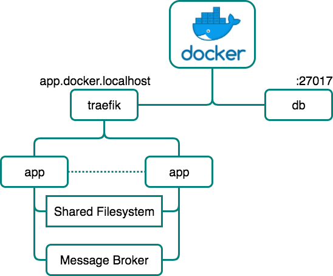
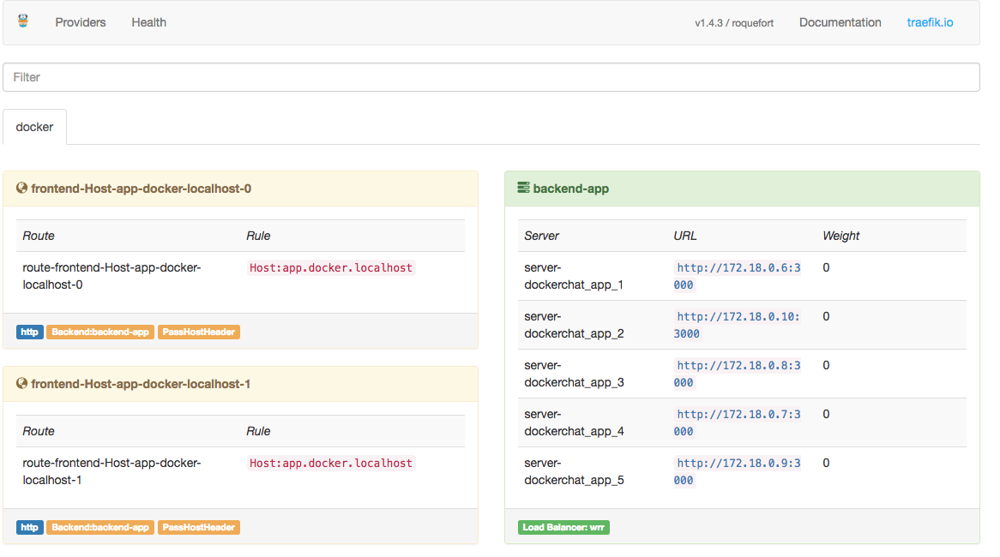
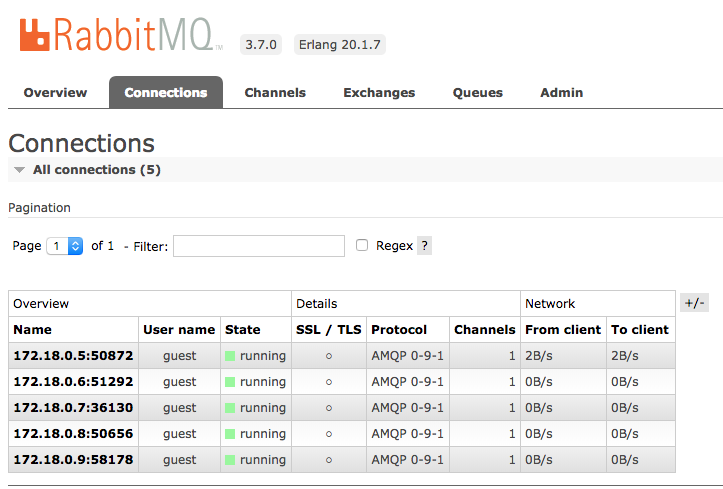

# Scaling with docker-compose

This task consists on scalling previous deployment of the system with `docker-compose` on a local enviroment.

## Initial requirements

+ `Docker` and `docker-compose`
+ Clone `docker-chat` repository and copy it into `/demo` folder
    ```bash
    git clone https://github.com/ageapps/docker-chat
    ```
+ In order to deploy the system with `docker-compose` it's needed an additional configuration. [traefik] proxy needs to use a DNS name in order to provide session affinity. For this, the DNS name chosen is `app.docker.localhost`, and it has to be added into the `/etc/hosts` file:

    ```bash
    ...
    127.0.0.1  app.docker.localhost
    ...
    ```
## Setup

+ __Web (app):__ [NodeJS] server containin all business logic and that [features](#features)  mentioned above. It uses the official [NodeJS image] as base image.
+ __Database (db):__ [MongoDB] database. It uses the official [MongoDB image] with an additional startup script which sets up users in order to have a securized database (using `MONGO_DB_APP_PASSWORD`, `MONGO_DB_APP_USERNAME`, `MONGO_DB_APP_DATABASE` enviroment variables).

+ __Load Balancer (proxy):__ [traefik] proxy. __This service is only used when deploying with `docker-compose`__. This load balancer is needed in order to handle the service repplication and balance traffic between them aswell as session affinity for WebSocket support. It uses the official [traefik image] being the access point to the system. There is a management interface accesing `localhost` in port `8080`.


+ __Message Broker (rabbit):__ This service is needed in order to scale WebSockets. It's possible to use the [RabbitMQ] as message broker. For this it's used the [Rabbit Adapter].   
        To connect to the RabbitMQ service it's needed to use the `RABBIT_HOST` enviroment variable. 
        RabbitMQ has a management web interface which is accessible using `localhost` in port `15672`.
        
## Steps

### Deployment
```bash
$ cd demo
$ docker-compose -f docker-compose.rabbit.yaml up -d
Creating network "dockerchat_default" with the default driver
Starting dockerchat_proxy_1 ...
Starting dockerchat_proxy_1
Starting dockerchat_rabbit_1 ...
Starting dockerchat_rabbit_1
Creating dockerchat_db_1 ...
Creating dockerchat_db_1 ... done
Creating dockerchat_app_1 ...
Creating dockerchat_app_1 ... done
# connect in your browser to app.docker.localhost
# connect in your browser to <host IP>:8888 for the configuration pannel

$ docker ps
CONTAINER ID        IMAGE                       COMMAND                  CREATED             STATUS                    PORTS                                                                     NAMES
551c7544a539        ageapps/docker-chat:app     "nodemon ./bin/www"      27 seconds ago      Up 25 seconds             3000/tcp                                                                  dockerchat_app_1
3508a0f43d6d        ageapps/docker-chat:mongo   "docker-entrypoint..."   58 seconds ago      Up 56 seconds (healthy)   0.0.0.0:27017->27017/tcp                                                  dockerchat_db_1
ac33c8572dff        rabbitmq:3-management       "docker-entrypoint..."   4 days ago          Up 56 seconds             4369/tcp, 5671-5672/tcp, 15671/tcp, 25672/tcp, 0.0.0.0:15672->15672/tcp   dockerchat_rabbit_1
7b8a8180c84f        traefik                     "/traefik --web --..."   4 days ago          Up 56 seconds             0.0.0.0:80->80/tcp, 0.0.0.0:8080->8080/tcp                                dockerchat_proxy_1
```

### Scale Application
```bash
$ docker-compose -f docker-compose.rabbit.yaml scale app=5
WARNING: The scale command is deprecated. Use the up command with the --scale flag instead.
Starting dockerchat_app_1 ... done
Creating dockerchat_app_2 ...
Creating dockerchat_app_3 ...
Creating dockerchat_app_4 ...
Creating dockerchat_app_5 ...
Creating dockerchat_app_2 ... done
Creating dockerchat_app_3 ... done
Creating dockerchat_app_4 ... done
Creating dockerchat_app_5 ... done
```
Check in RabbitMQ dashboard that all replicas are connected
### Clean Enviroment
```
# To stop the system
$ docker-compose -f docker-compose.rabbit.yaml down -v
Stopping dockerchat_app_1 ... done
Stopping dockerchat_db_1  ... done
Removing dockerchat_app_1 ... done
Removing dockerchat_db_1  ... done
Removing network dockerchat_default
```


[NodeJS image]: https://hub.docker.com/_/node/
[MongoDB image]: https://hub.docker.com/_/mongo/
[MongoDB]: https://www.mongodb.com
[mongoose]: http://mongoosejs.com/index.html
[NodeJS]: http://nodejs.org
[Docker]: https://docs.docker.com/
[docker-compose]:https://docs.docker.com/compose/compose-file/
[docker-build]:https://docs.docker.com/engine/reference/builder/
[Kubernetes]:https://kubernetes.io/
[WebSocket handshake]:https://tools.ietf.org/html/rfc6455
[WebSocket]:https://en.wikipedia.org/wiki/WebSocket
[MongoStore]:https://www.npmjs.com/package/connect-mongo
[GlusterFS]:https://www.gluster.org/
[traefik]:https://traefik.io/
[NATS]:https://nats.io/
[NATS Adapter]:https://www.npmjs.com/package/socket.io-nats
[RabbitMQ]:https://www.rabbitmq.com/
[Rabbit Adapter]:https://www.npmjs.com/package/socket.io-amqp
[Redis]:https://redis.io/
[Redis Adapter]:https://github.com/socketio/socket.io-redis
[traefik image]:https://hub.docker.com/r/_/traefik/
[SocketIO]:https://socket.io/
[Express Session]:https://github.com/expressjs/session
[NGINX Ingress Controller]: https://github.com/kubernetes/ingress-nginx
[ingress documentation]: https://github.com/kubernetes/ingress-nginx/blob/master/docs/catalog.md