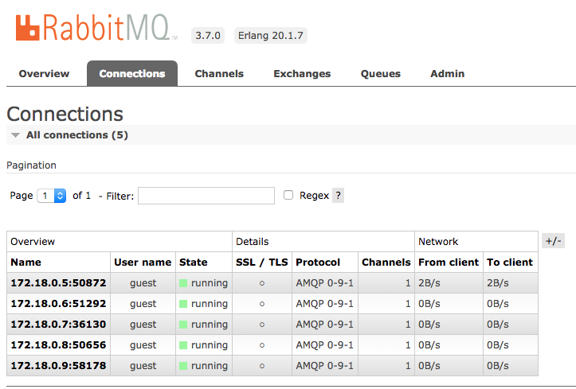

# Kubernetes Deployment

This task consists on deploying the system on a Kubernetes cluster.

## Initial requirements

+ `Docker` and `docker-compose`
+ Clone `docker-chat` repository and copy it into `/demo` folder
    ```bash
    git clone https://github.com/ageapps/docker-chat
    ```
+ Create Google Cloud Platform account and follow the instructions mentioned in the [introduction](../README.md) to create the cluster.
## Setup

+ __docker-chat:__ [NodeJS] server containin all business logic and that [features](#features)  mentioned above. It uses the official [NodeJS image] as base image.
+ __mongoDB:__ [MongoDB] database. It uses the official [MongoDB image] with an additional startup script which sets up users in order to have a securized database (using `MONGO_DB_APP_PASSWORD`, `MONGO_DB_APP_USERNAME`, `MONGO_DB_APP_DATABASE` enviroment variables).

+ __RabbitMQ:__ This service is needed in order to scale WebSockets. It's possible to use the [RabbitMQ] as message broker. For this it's used the [Rabbit Adapter].   
        To connect to the RabbitMQ service it's needed to use the `RABBIT_HOST` enviroment variable. 
        RabbitMQ has a management web interface which is accessible using port `15672`.
        

+ __Ingress Controller:__ To scale WebSockets, it's needed to have session affinity in the `Load Balancer` service of our system, for this, it's proviced an example [here](./demo/k8s/ingress) (`demo/k8s/ingress`) using [NGINX Ingress Controller]. There can be found more information about this ingress controller and other examples of them in the [ingress documentation].

+ __GlusterFS:__ when deploying the application in a real-life enviroment, replicas will be distributed son sharing a local volume becomes impossible. For this, [Distributed Filesystems] are the best solution, in this example it will be used [GlusterFS].


## Steps

### Deploy configurations
```bash
$ cd demo
$ kubectl apply -f k8s/global-congig.yaml
```
### Deploy services
Before deploying any service it's needed to set the message broker for this, it's necessary to configure it in the `k8s/docker-chat/docker-chat.yaml` file by un commenting the configuration needed for each message broker.
```yaml
###### MESSAGE BROKERS ########
        # REDIS
        # - name: REDIS_HOST
        #   valueFrom:
        #     configMapKeyRef:
        #       name: global-config
        #       key: app.redis_host
        # RABBIT
        - name: RABBIT_HOST
          valueFrom:
            configMapKeyRef:
              name: global-config
              key: app.rabbit_host
        # # NATS
        # - name: NATS_HOST
        #   valueFrom:
        #     configMapKeyRef:
        #       name: global-config
        #       key: app.nats_host
```

Now, let's deploy the services
```bash
$ kubectl apply -f k8s/mongo
$ kubectl apply -f k8s/rabbit
# Main service
$ kubectl apply -f k8s/docker-chat
$ kubectl get pods
NAME                           READY     STATUS    RESTARTS   AGE
docker-chat-3196960154-4gxw5   1/1       Running   0          4s
mongo-1951328931-5nnd9         1/1       Running   0          4s
rabbit-915595363-3tsrx         1/1       Running   0          4s

```

### Scale Application
```bash
$ kubectl scale --replicas=3 deploy/docker-chat
deployment "docker-chat" scaled
$ kubectl get pods
NAME                           READY     STATUS              RESTARTS   AGE
docker-chat-3196960154-4gxw5   1/1       Running             0          4d
docker-chat-3196960154-lvb85   0/1       ContainerCreating   0          5s
docker-chat-3196960154-n6tgq   0/1       ContainerCreating   0          5s
mongo-1951328931-5nnd9         1/1       Running             0          4d
rabbit-915595363-3tsrx         1/1       Running             0          4d
```

### Clean Enviroment
```bash
# To stop the system
$ kubectl delete namespace chat
```

### Setup Ingress
For this, go to [the ingress foldeer](./demo/k8s/ingress) (`demo/k8s/ingress`) where an example is provided using [NGINX Ingress Controller]. 
Once deployed the ingress controler, let's create out `ingress` instance:
```bash
kubectl apply -f k8s/ingress/app-ingress.yaml
```

With this done, a Load Balancer instance should have been created in the Google Cloud Platform Dashboard.


Google will assign a public IP to your Load Balancer and now it can be accessed from your browser.

### GlusterFS deployment
Considering a [GlusterFS] cluster is already deployed ([Here](https://github.com/GoogleCloudPlatform/compute-ansible-gluster) is a great example of how to do it) let`s mount it as a volume in our containers.
In order to use the [GlusterFS] feature there are some considerations to take care. On the first hand, the cluster ip adresses should be added into the `glusterfs/glusterfs.yaml` file.
```yaml
kind: Endpoints
apiVersion: v1
metadata:
  name: glusterfs
subsets:
  - addresses:
      - ip: XXXXX
    ports:
      - port: 1
  - addresses:
      - ip: XXXXX
    ports:
      - port: 1
```
Additionaly, the commented lines related to the volume mount of the GlusterFS system need to be uncommented:
```yaml
spec:
      # volumes:
      # - name: glusterfs-content
      #   glusterfs:
      #     endpoints: glusterfs-cluster
      #     path: kube-vol
      #     readOnly: true   
      containers:
      - name: "docker-chat"
        image: "ageapps/docker-chat:app"
        imagePullPolicy: Always
        ports:
          - containerPort: 3000
        command: ["bash", "-c", "nodemon ./bin/www"]
        # volumeMounts:
        # - name: glusterfs-content
        #   mountPath: /uploads
```
Finally, update all services and deploy the needed services. There is the possibillity to test what the content inside the cluster is by deloying the `browser` service.
```bash
$ kubectl apply -f k8s/glusterfs
# Main service
$ kubectl apply -f k8s/docker-chat
# Browser service
$ kubectl apply -f k8s/browser
```

### Forward Rabbit dashboard

```
kubectl port-forward [POD_ID] 8080:15672
```
### Forward GLUSTERFS volume browser

```
kubectl port-forward [POD_ID] 8080:8080
```

[NodeJS image]: https://hub.docker.com/_/node/
[MongoDB image]: https://hub.docker.com/_/mongo/
[MongoDB]: https://www.mongodb.com
[mongoose]: http://mongoosejs.com/index.html
[NodeJS]: http://nodejs.org
[Docker]: https://docs.docker.com/
[docker-compose]:https://docs.docker.com/compose/compose-file/
[docker-build]:https://docs.docker.com/engine/reference/builder/
[Kubernetes]:https://kubernetes.io/
[WebSocket handshake]:https://tools.ietf.org/html/rfc6455
[WebSocket]:https://en.wikipedia.org/wiki/WebSocket
[MongoStore]:https://www.npmjs.com/package/connect-mongo
[GlusterFS]:https://www.gluster.org/
[traefik]:https://traefik.io/
[NATS]:https://nats.io/
[NATS Adapter]:https://www.npmjs.com/package/socket.io-nats
[RabbitMQ]:https://www.rabbitmq.com/
[Rabbit Adapter]:https://www.npmjs.com/package/socket.io-amqp
[Redis]:https://redis.io/
[Redis Adapter]:https://github.com/socketio/socket.io-redis
[traefik image]:https://hub.docker.com/r/_/traefik/
[SocketIO]:https://socket.io/
[Express Session]:https://github.com/expressjs/session
[NGINX Ingress Controller]: https://github.com/kubernetes/ingress-nginx
[ingress documentation]: https://github.com/kubernetes/ingress-nginx/blob/master/docs/catalog.md