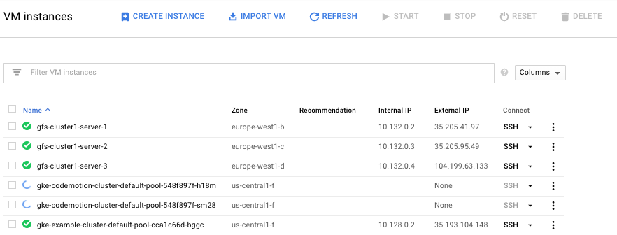

# Codemotion 2017 Workshop - Microservices in production with Kubernetes
This repo corresponds to a workshop done in the Codemotion 2017 event.
Slides can be found [HERE](https://speakerdeck.com/adrian_gespi/microservices-in-production-with-kubernetes-codemotion-2017)


## Initial steps

This workshop is based on Google Cloud Platform [Container Engine] which gives a very simple way of creating and managing Kubernetes clusters.

It is recomended to use the [free trial](https://cloud.google.com/free/) that Google offers to try all its services.

### Create Cluster on Google Cloud Platform
Cluster can be created through the [Cloud Console](https://console.cloud.google.com/) or using the [gcloud] bash utility. (The )
```
gcloud container clusters create codemotion-cluster --num-nodes=3
```


### Install kubectl
Follow the [instalation guide](https://cloud.google.com/container-engine/) according to your OS.

### Configure kubectl
Get the credentials needed for kubectl to authentikate and be able to manage your cluster.
Note that you have to put your own data instead of `codemotion-cluster` or the project's name `codemotion` 
```bash
gcloud container clusters get-credentials codemotion-cluster --project codemotion
```
Now, you should be able to access your cluster using `kubectl`.
```bash
kubectl get nodes
NAME                                                STATUS    AGE       VERSION
gke-codemotion-cluster-default-pool-548f897f-4d0p   Ready     51m       v1.7.8-gke.0
gke-codemotion-cluster-default-pool-548f897f-5sx5   Ready     51m       v1.7.8-gke.0
gke-codemotion-cluster-default-pool-548f897f-h18m   Ready     51m       v1.7.8-gke.0
```
### Setup a custom namespace
Once kubctl works, it is a good practice to create a namespace in order to isolate your system from others in your cluster. In this case the namespace name will be `chat`.
```bash
kubectl create namespace chat
# set kubctl to use chat namespace as default
kubectl config set-context $(kubectl config current-context) --namespace=chat
# check current namespace
kubectl config view | grep namespace:
```


### Syncronize docker-chat repo
The codebase of this workshop is based on another project called [docker-chat](https://github.com/ageapps/docker-chat), which is a very example of system using containers, microservices and a lot of other technologies.

It is needed to download the repo to get all the code that will be used through the workshop.
```bash
git clone https://github.com/ageapps/docker-chat
```
Now, copy the content of the repo into the `demo` directory. As an example you could use `rsync`.
```bash
rsync -r ../docker-chat/ ./demo/
```

__ANY ADITIONAL INFORMATION NEEDED CAN BE FOUND IN THE docker-chat__ REPOSITORY.

## Task 1
This task will use `docker-compose` as a tool to make a basic local deployment.

Jump to [task 1](./1-single-instance-app) directory.
## Task 2
This task will use `docker-compose` as a tool to make a deployment similar to the one deployed in Kubernetes.

Jump to [task 2](./2-scalable-app) directory.
## Task 3
This is the actual Kuberentes deployment
Jump to [task 3](./3-gke-deploy) directory.

## Resources
+ [Docker]: Software containerization platform
+ [SocketIOChatDemo]: Chat web application.
+ [NodeJS]: Server enviroment.
+ [MongoDB]: NoSQL database system.
+ [mongoose]: MongoDB object modeling for *node.js*.
+ [docker-build]: Automated build of *Docker* images.
+ [docker-compose]: Automated configuration and run of multi-container *Docker* applications.
+ [Kubernetes]: Open-source system for automating deployment, scaling, and management of containerized applications.


[here]: http://swarm1397.cloudhero.io:8080/
[Microservices architecture]: http://microservices.io/patterns/microservices.html
[SocketIOChatDemo]: https://github.com/ageapps/SocketIOChatDemo.git
[NodeJS image]: https://hub.docker.com/_/node/
[MongoDB image]: https://hub.docker.com/_/mongo/
[MongoDB]: https://www.mongodb.com
[mongoose]: http://mongoosejs.com/index.html
[NodeJS]: http://nodejs.org
[Docker]: https://docs.docker.com/
[docker-compose]:https://docs.docker.com/compose/compose-file/
[docker-build]:https://docs.docker.com/engine/reference/builder/
[Kubernetes]:https://kubernetes.io/
[WebSocket handshake]:https://tools.ietf.org/html/rfc6455
[WebSocket]:https://en.wikipedia.org/wiki/WebSocket
[MongoStore]:https://www.npmjs.com/package/connect-mongo
[GlusterFS]:https://www.gluster.org/
[traefik]:https://traefik.io/
[NATS]:https://nats.io/
[NATS Adapter]:https://www.npmjs.com/package/socket.io-nats
[RabbitMQ]:https://www.rabbitmq.com/
[Rabbit Adapter]:https://www.npmjs.com/package/socket.io-amqp
[Redis]:https://redis.io/
[Redis Adapter]:https://github.com/socketio/socket.io-redis
[traefik image]:https://hub.docker.com/r/_/traefik/
[SocketIO]:https://socket.io/
[Express Session]:https://github.com/expressjs/session
[NGINX Ingress Controller]: https://github.com/kubernetes/ingress-nginx
[ingress documentation]: https://github.com/kubernetes/ingress-nginx/blob/master/docs/catalog.md